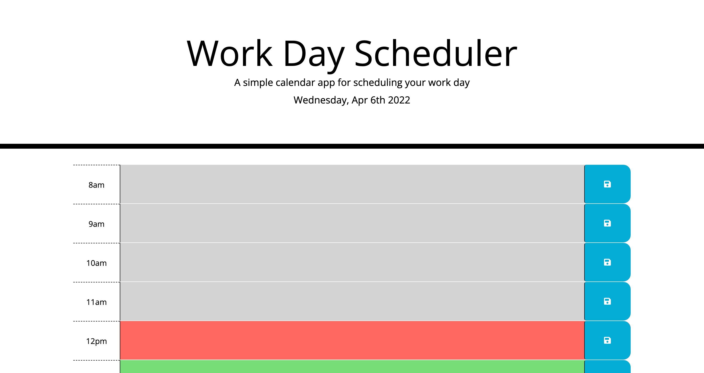

# Work-Day-Scheduler
 

  <h3 align="center">Work Day Scheduler!</h3>

  

    Simple calendar application that allows a user to save events for each hour of the day. Made using html, css, jquery and moment.js.
     

  
Project Table of Contents

  <ol>
    <li>
      <a href="#about-the-project">About The Project</a>
      <ul>
        <li><a href="#built-with">Built With</a></li>
      </ul>
    <li><a href="#usage">Usage</a></li>
    <li><a href="#license">License</a></li>
    <li><a href="#contact">Contact</a></li>
  </ol>

## About The Project

This javascript scheduler was built as a coding assessment, trying to achieve both functionality and great looks! 

Made following these premises:
* GIVEN I am using a daily planner to create a schedule
* WHEN I open the planner
* THEN the current day is displayed at the top of the calendar
* WHEN I scroll down
* THEN I am presented with timeblocks for standard business hours
* WHEN I view the timeblocks for that day
* THEN each timeblock is color coded to indicate whether it is in the past, present, or future
* WHEN I click into a timeblock
* THEN I can enter an event
* WHEN I click the save button for that timeblock
* THEN the text for that event is saved in local storage
* WHEN I refresh the page
* THEN the saved events persist

The app runs in the browser and features HTML, CSS, Bootstrap, jQuery and Moment.js.

(<a href="#top">back to top</a>)

### Built With

Built with HTML CSS, Bootstrap, jQuery and Moment.js libraries:

* [jQuery](https://jquery.com/)
* [HTML](https://developer.mozilla.org/en-US/docs/Web/HTML)
* [CSS](https://developer.mozilla.org/en-US/docs/Web/CSS)
* [Moment.js](https://momentjs.com/)

(<a href="#top">back to top</a>)

## Usage

Used as a daily planner that saves the input tasks even though you close the page or tab.

(<a href="#top">back to top</a>)

## License

Made by Mario Mendoza with <3.

(<a href="#top">back to top</a>)

## Contact

Mario Antonio Mendoza Barrientos - mariombarrientos@gmail.com

Project Link: [Work Day Scheduler!](https://mayo-mm.github.io/Work-Day-Scheduler/)

(<a href="#top">back to top</a>)
